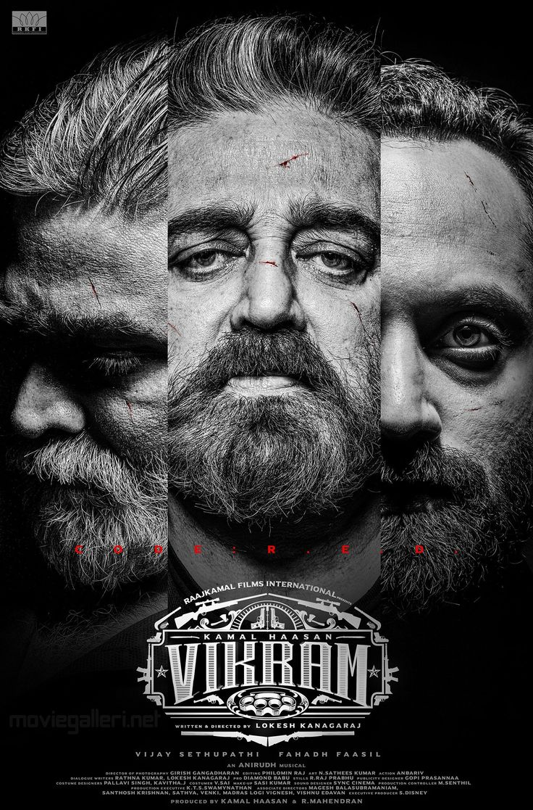
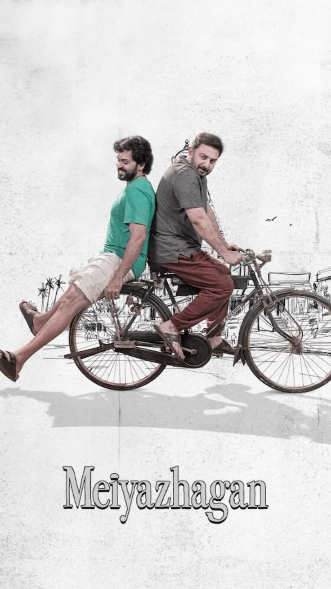
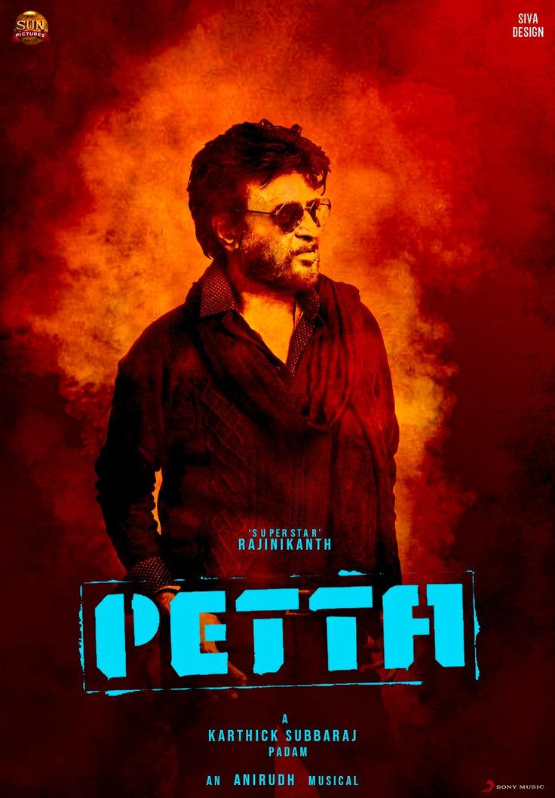

# Ex.08 Design of Interactive Image Gallery
## Date:

## AIM:
To design a web application for an inteactive image gallery with minimum five images.

## DESIGN STEPS:

### Step 1:
Clone the github repository and create Django admin interface.

### Step 2:
Change settings.py file to allow request from all hosts.

### Step 3:
Use CSS for positioning and styling.

### Step 4:
Write JavaScript program for implementing interactivity.

### Step 5:
Validate the HTML and CSS code.

### Step 6:
Publish the website in the given URL.

## PROGRAM :
```
<!DOCTYPE html>
<html lang="en">
<head>
  <meta charset="UTF-8">
  <meta name="viewport" content="width=device-width, initial-scale=1">
  <title>Interactive Image Gallery</title>
  <style>
    body {
      font-family: Arial, sans-serif;
      margin: 0;
      padding: 0;
      background: #f2f2f2;
    }

    header {
      background: #333;
      color: white;
      text-align: center;
      padding: 20px;
    }

    h1 {
      margin: 0;
      font-size: 2.5em;
    }

    h2 {
      margin: 10px 0 5px;
      font-weight: normal;
      font-size: 1.5em;
    }

    h3 {
      margin: 0;
      font-size: 1em;
      color: #ccc;
    }

    .gallery {
      display: grid;
      grid-template-columns: repeat(auto-fit, minmax(250px, 1fr));
      gap: 15px;
      padding: 20px;
      max-width: 1200px;
      margin: auto;
    }

    .gallery img {
      width: 75%;
      border-radius: 10px;
      cursor: pointer;
      transition: transform 0.3s ease;
    }

    .gallery img:hover {
      transform: scale(1.05);
    }

    .lightbox {
      display: none;
      position: fixed;
      z-index: 10;
      top: 0;
      left: 0;
      width: 100%;
      height: 100%;
      background: rgba(0,0,0,0.8);
      justify-content: center;
      align-items: center;
    }

    .lightbox img {
      max-width: 90%;
      max-height: 80%;
      border-radius: 10px;
    }

    .close {
      position: absolute;
      top: 20px;
      right: 30px;
      font-size: 30px;
      color: white;
      cursor: pointer;
    }
  </style>
</head>
<body>

<header>
  <h1>Interactive Image Gallery</h1>
  <h2>Top Tamil Movies</h2>
  <h3>KARTHIKEYAN S (212224230116)</h3>
</header>

<div class="gallery">
  
  
  
  
  
  
  
  
</div>

<div class="lightbox" id="lightbox">
  <span class="close" onclick="closeLightbox()">&times;</span>
  
</div>

<script>
  const galleryImages = document.querySelectorAll('.gallery img');
  const lightbox = document.getElementById('lightbox');
  const lightboxImg = document.getElementById('lightbox-img');

  galleryImages.forEach(img => {
    img.addEventListener('click', () => {
      lightbox.style.display = 'flex';
      lightboxImg.src = img.src;
    });
  });

  function closeLightbox() {
    lightbox.style.display = 'none';
  }

  // Optional: Close lightbox on click outside the image
  lightbox.addEventListener('click', (e) => {
    if (e.target !== lightboxImg) {
      closeLightbox();
    }
  });
</script>

</body>
</html>
```
## OUTPUT:

## RESULT:
The program for designing an interactive image gallery using HTML, CSS and JavaScript is executed successfully.
